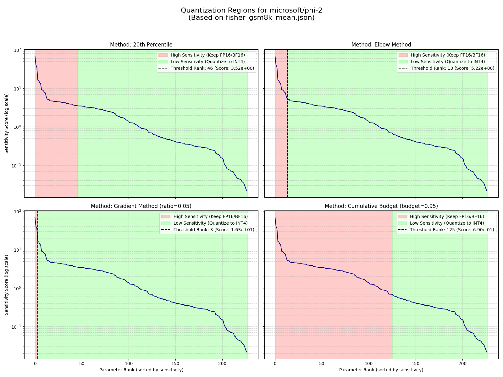
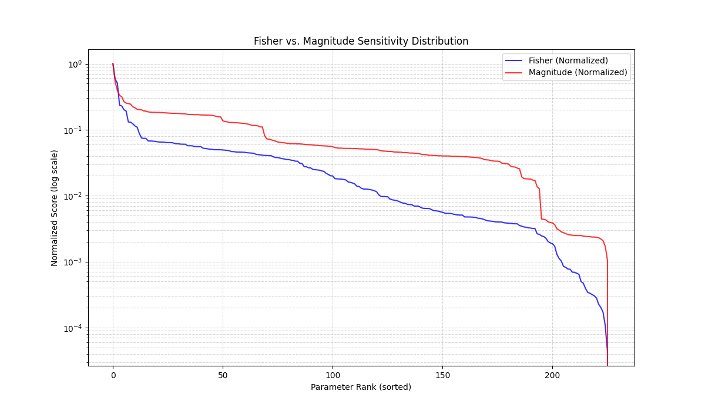
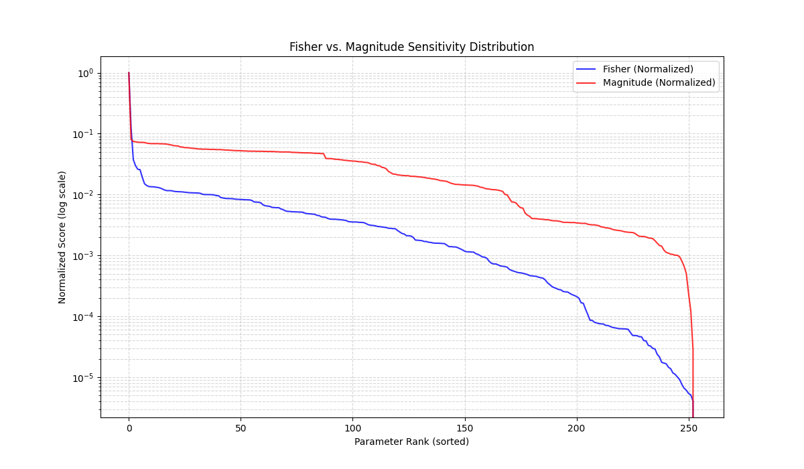

# Task-Aware Selective Quantization for LLMs

Standard post-training quantization methods often degrade model performance on reasoning-heavy tasks by applying uniform compression policies. This project investigates *Task-Aware Selective Quantization* on Microsoft Phi-2 2.7B and Llama-3 3B, leveraging Fisher Information metrics to identify and preserve the "structural load-bearing" components of the models.

## Model Dynamics & Sensitivity Physics

The Fisher Information maps generated in this study reveal distinct "physics" for different architectures. These sensitivity scores are not random. They correlate directly with the functional roles of specific layers and the cognitive demands of the GSM8K (Grade School Math) dataset. This analysis supports the implementation of a "Task-Aware" strategy that goes beyond simple uniform quantization.

*Figure 1: Fisher Information sensitivity map for Phi-2 on GSM8K, highlighting the "Bottom-Heavy, Top-Heavy" structure.*

When we look at how Microsoft Phi-2 handles these math problems, the sensitivity distribution tells a clear story about its cognitive process. It starts with an unusually high sensitivity in the very first Value Projection (Layer 0 `v_proj`), which effectively acts as the model's working memory. Since GSM8K problems usually start by initializing variables, this layer is responsible for binding those raw token integers into the semantic residual stream. Think of it as a copy-paste mechanism. If we quantize Layer 0, we corrupt the variables right at the source, meaning the downstream reasoning engine will be operating perfectly on the wrong numbers. The concise Q&A prompt structure also imposes a rigid rhythm on the generation, which amplifies the importance of this layer for switching modes between passive reading and active reasoning.

Moving into the middle layers (6 through 20), the sensitivity shifts toward the MLP blocks. This is the reasoning engine of the model. These MLPs function as key-value memories that handle the actual arithmetic transformations. We can see that computation is the bottleneck here because the MLPs show higher sustained sensitivity than the attention mechanisms in these layers. However, because we use concise 4-shot prompts that strip away linguistic fluff, these middle layers become surprisingly robust. They can handle aggressive INT4 quantization as long as the input signal remains pristine.

The most critical phase transition happens at Layer 29, specifically in the `input_layernorm` and `self_attn.k_proj`. This layer acts as a sort of coherence aggregator or event horizon for the chain-of-thought process. At this depth, the model isn't doing new arithmetic anymore. Instead, it is looking back at the entire generated trace to synthesize a final conclusion. The extreme sensitivity here proves that the model is actively using the few-shot examples as dynamic templates for its reasoning structure. If we quantize this layer, we sever the link between the prompt's instructions and the generation. This destroys the model's ability to trust its own logic chain, leading to hallucinations that look coherent but are factually wrong.

*Figure 2: Fisher Information sensitivity map for Llama-3 3B on GSM8K, revealing the critical Layer 1 "Filter" anomaly.*

Llama-3 3B operates with a fundamentally different mechanical dynamic. Its most striking feature is a massive anomaly in Layer 1 `down_proj`, where sensitivity scores are orders of magnitude higher than the rest of the network. This is likely an artifact of the SwiGLU activation function and the specific architecture of Llama. The up-projection generates a vast amount of high-dimensional features, so Layer 1 `down_proj` has to function as a high-pass filter to clean up the signal. It aggressively suppresses incoherent dimensions and noise introduced by that initial expansion. It is not performing reasoning so much as it is performing signal cleaning. If we quantize this layer, we stop it from suppressing that noise, which floods the residual stream with high-frequency garbage and destabilizes all the subsequent attention heads. Similar to Phi-2, Llama-3 3B also shows high sensitivity in its anchor points, which are the Input Embeddings and the Language Modeling Head. These layers define the semantic subspace, so quantizing them distorts the entire coordinate system of the model.

Comparing these two models shows us why general-purpose quantization often fails. Phi-2 operates as a bottom-heavy, top-heavy system. It demands extreme precision at the start to load variables and at the end to synthesize the answer, but its middle reasoning engine is computationally robust. It relies on preserving signal integrity through the LayerNorms and specific attention projections to keep the linear logic path straight. Llama-3 3B, on the other hand, is a filter-dependent machine. Its stability relies entirely on specific high-precision gates like the Layer 1 down-projection to manage its own internal noise floor. While Phi-2 fails if its logic chain is disrupted, Llama-3 3B fails if its signal-to-noise ratio drops below a critical threshold.

*Figure 3: Comparative sensitivity of Phi-2 on Arithmetic (GSM8K) vs. Algebra (MATH) tasks, showing the shift in computational load.*

We also see that the specific task matters. When we compare the maps for GSM8K (arithmetic) and MATH (algebra) on Phi-2, we see a shift in priorities. GSM8K stresses the structural components like LayerNorms, but harder algebra problems require higher fidelity in the deep MLPs to handle complex variable transformations. This confirms that for simple arithmetic, we must prioritize the signal integrity of the attention path, but for complex algebra, we need to preserve the compute capacity of the MLPs.

There is also a dangerous trap when relying on simple magnitude metrics versus the deeper Fisher Information maps.

*Figure 4: Fisher Information vs. Weight Magnitude for Phi-2. Note the divergence at Layer 29 (Coherence Gate).*

For Phi-2, this divergence is critical at the coherence gate in Layer 29. The magnitude map assigns the `k_proj` weights in this layer a very low score, suggesting they are insignificant. A magnitude-based policy would immediately quantize this layer. However, the Fisher map identifies it as a top-3 sensitivity hotspot. This indicates that while these weights are numerically small, they are performing delicate, high-precision work to retrieve reasoning templates from the context window. Magnitude metrics fail to capture this information density and mistake small weights for unimportant ones.

*Figure 5: Fisher Information vs. Weight Magnitude for Llama-3 3B. Note the massive divergence at Layer 1 (Noise Filter).*

For Llama-3 3B, the divergence appears in the cleanup mechanism. The magnitude map emphasizes the massive weights in the deep attention heads, assigning them top priority, but it completely misses the anomaly in Layer 1. Fisher Information flags Layer 1 as the single most critical component for stability. This suggests that magnitude prioritizes structural mass, or layers that store knowledge, whereas Fisher prioritizes information velocity, or layers that transform and filter the signal flow. Relying on magnitude for Llama-3 would preserve the deep knowledge layers while destroying the early noise filter, rendering that preserved knowledge inaccessible due to upstream signal corruption.

An examination of the reasoning traces generated by the quantized models reveals a specific, recurring failure mode that statistical accuracy metrics miss. In both Phi-2 and Llama-3 3B, the **Selective Quantization** models (which prioritize layers based on Fisher Information) exhibit a unique "Feature Collapse" when handling repetitive variables. A prime example is the "Sprints" problem: "*James decides to run 3 sprints 3 times a week.*" The correct logic is $3 \times 3 \times 60 = 540$ meters. While the baseline model correctly identifies both multipliers, the selective model erroneously calculates $3 \times 60 = 180$ meters. This specific error appears in both architectures under selective quantization. It suggests that the Fisher metric might be undervaluing the **redundancy** required to process repetitive numerals. The model effectively "merges" the two distinct "3"s into a single semantic entity. This implies that while the "Reasoning Engine" (MLPs) is robust for distinct operations, the "Attention Heads" responsible for distinguishing identical tokens in different positions are being aggressively quantized. The selective policy correctly identifies the "Reasoning" layers as important but fails to protect the "Position-Aware" attention heads that prevent this kind of variable aliasing. This qualitative finding highlights a subtle limitation of Fisher-based selection: it optimizes for *global* loss reduction, which may inadvertently sacrifice the *local* redundancy needed for precise variable tracking in repetitive contexts.

Ultimately, these profiles allow us to infer the fundamental computational density of these architectures. Phi-2 functions as a highly specialized, low-entropy system. Its sensitivity map is sparse, with sharp peaks and deep valleys. This implies a rigid functional specialization where the model has compartmentalized its logic into discrete stages of assembly, computation, and synthesis. It processes tasks linearly, mimicking the structure of the chain-of-thought. This makes the middle layers highly compressible, but it renders the model structurally brittle because a single point-failure in a high-density layer collapses the entire pipeline.

Llama-3 3B operates as a high-entropy, high-density system. Aside from the massive filtration spike in Layer 1, its baseline sensitivity is more uniformly distributed and generally higher than Phi-2’s middle layers. This suggests a holographic processing style where information is not strictly compartmentalized but is redundantly encoded across the depth of the network. Llama-3 relies on generating a massive surplus of high-dimensional signals and then aggressively filtering them. This redundancy makes it more robust to structural quantization errors, as drift in one layer can be corrected by the next, but it paradoxically makes it highly sensitive to the noise floor. It processes tasks by iteratively refining a noisy signal manifold rather than simulating a linear pipeline. Consequently, Llama-3 requires a quantization strategy that prioritizes global signal quality and filtering, whereas Phi-2 requires one that prioritizes the preservation of specific functional gates.